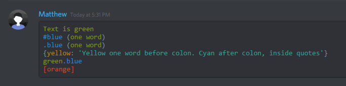

# Markdown Discord

Pimentez et améliorez votre message en utilisant Markdown, la coloration syntaxique et les formats dans Discord.

## Styles

*Italique*	\*italique* **ou** \_italique\_

**Gras**	\*\*gras**

__Souligné__	\_\_souligné__

~~Barré~~	 \~\~barré~~

__*Souligné italique*__	\__\*souligné italique*__

__**Souligné gras**__	\__\*\*Souligné gras**__

***Gras italique***	\*\*\*gras italique***

__***Souligné gras italique***__	\__\*\*\*souligné gras italique***__

* **Caractère d'échappement**

Vous ne souhaitez pas utiliser le format Markdown ? Vous pouvez placer une barre oblique inverse (\\\) devant le caractère pour l'échapper. Gardez à l'esprit que cela ne fonctionne pas dans les messages contenant des modifications ou des underscores.

## Blocs de code

Vous pouvez créer vos propres blocs de code en entourant votre texte avec des backtiks (`)

**Attention:** Ce n'est pas le même caractère que le simple quote (')

Vous pouvez également utiliser trois backticks (\`\`\`) pour créer un bloc de code multi-lignes

## Coloration syntaxique

Vous pouvez choisir un langage spécifique pour la **coloration syntaxique** en écrivant le nom du langage juste après les trois backticks au début de votre bloc de code multi-lignes. Exemple...

**Attention:** La syntaxe est précisément "trois backticks" suivie du "nom du langage" suivie d'un "retour à la ligne" `\`\`\`lang<LF>`

Il existe une grande variété de langages supportés par la coloration syntaxique de Discord dans les blocs Markdown. Chaque langage possède sa propre coloration. Pour une liste complète, voir: https://highlightjs.org/static/demo/

asciidoc

autohotkey

bash

coffeescript

cpp

cs

css

diff

fix

glsl

html

ini

json

md

ml

prolog

py

tex

xl

xml

Vous avez compris le truc ! Vous êtes maintenant un ✨ **Expert en Markdown Discord** ✨. Allez colorer vos extraits de code !

## Credits

* [Discord Article](https://support.discordapp.com/hc/en-us/articles/210298617-Markdown-Text-101-Chat-Formatting-Bold-Italic-Underline-)

* [webermn15](https://gist.github.com/webermn15/47e3fb4ccadf8ac3cf66ee9011a507f5)